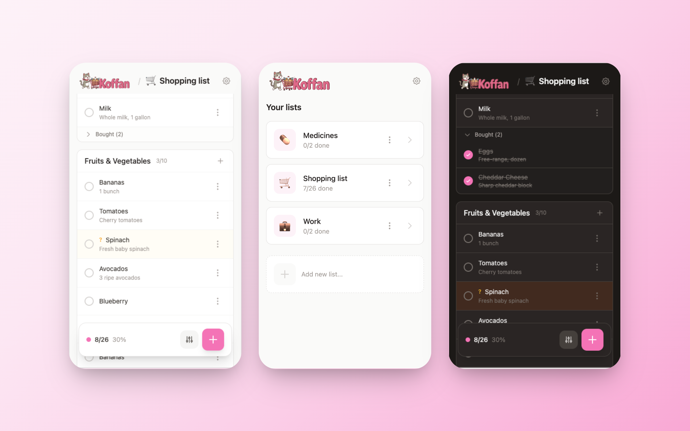

<p align="center">
  
</p>

<h1 align="center">Koffan</h1>

<p align="center">
  <strong>Free shopping assistant</strong><br>
  A fast and simple app for managing your shopping list together
</p>

<p align="center">
  <a href="https://railway.app/new/template?template=https://github.com/PanSalut/Koffan"></a>
  &nbsp;
  <a href="https://render.com/deploy?repo=https://github.com/PanSalut/Koffan"></a>
  &nbsp;
  <a href="https://cloud.digitalocean.com/apps/new?repo=https://github.com/PanSalut/Koffan/tree/main"></a>
  &nbsp;
  <a href="https://heroku.com/deploy?template=https://github.com/PanSalut/Koffan"></a>
</p>

---

## Screenshots

<p align="center">
  
</p>

---

## What does "Koffan" mean?

Pronounced **KOF-fan** (rhymes with "coffin" but with an "a" at the end). The name comes from the Polish word *"kochanie"* (meaning "darling" or "sweetheart"), which evolved into a playful nickname. It's a long story, but let's just say the name stuck! :D

## What is Koffan?

Koffan is a lightweight web application for managing shopping lists, designed for couples and families. It allows real-time synchronization between multiple devices, so everyone knows what to buy and what's already in the cart.

The app works in any browser on both mobile and desktop. Just one password to log in - no complicated registration required.

## Why did I build this?

I needed an app that would let me and my wife create a shopping list together and do grocery shopping quickly and efficiently. I tested various solutions, but none of them were simple and fast enough.

I built the first version in **Next.js**, but it turned out to be very resource-heavy. I have a lot of other things running on my server, so I decided to optimize. I rewrote the app in **Go** and now it uses only **~2.5 MB RAM** instead of hundreds of megabytes!

## Features

- **Ultra-lightweight** - ~16 MB on disk, ~2.5 MB RAM
- **Multiple lists** - Create separate lists for different stores or purposes, with custom icons
- **PWA** - Install on your phone like a native app
- **Offline mode** - Add, edit, check/uncheck products without internet (auto-sync when back online)
- **Auto-completion** - Fuzzy search suggestions from your history, remembers sections
- Organize products into sections (e.g., Dairy, Vegetables, Cleaning)
- Mark products as purchased
- Mark products as "uncertain" (can't find it in the store)
- Real-time synchronization (WebSocket)
- Responsive interface (mobile-first)
- **Dark mode** - Automatic theme based on system preferences
- Multi-language support (PL, EN, DE, ES, FR, PT, UK, NO, LT, EL, SK, SV, RU)
- Simple login system
- Rate limiting protection against brute-force attacks
- **REST API** - Programmatic access for integrations and migrations ([docs](https://github.com/PanSalut/Koffan/wiki/REST-API))
- **Outbound webhooks** - Signed item events for automation tools such as n8n, Node-RED, and Zapier ([docs](https://github.com/PanSalut/Koffan/wiki/Webhooks))

## Tech Stack

- **Backend:** Go 1.25.12+ + Fiber
- **Frontend:** HTMX + Alpine.js + Tailwind CSS
- **Database:** SQLite

## Local Setup (without Docker)

You can run Koffan directly on your machine using Go 1.25.12 or newer. This works on any system (macOS, Linux, Windows).

### 1. Install Go

**macOS (Homebrew):**
```bash
brew install go
```

**Linux (Debian/Ubuntu):**
```bash
sudo apt install golang-go
```

**Windows:**
Download from [go.dev/dl](https://go.dev/dl/)

### 2. Clone and Run

```bash
git clone https://github.com/PanSalut/Koffan.git
cd Koffan
go run .
```

App available at http://localhost:3000

For a new database in development mode, Koffan creates a default administrator:

- Username: `admin`
- Password: `shopping123`

This fallback is disabled when `APP_ENV=production`. A new production database requires `ADMIN_USERNAME` and `ADMIN_PASSWORD` on its first startup.

To set a custom password:
```bash
ADMIN_USERNAME=admin ADMIN_PASSWORD=your-secure-password go run .
```

### Upgrading from a pre-multi-user database

Back up the SQLite database before upgrading. Older Koffan releases did not store the application password in SQLite; they compared logins directly with the `APP_PASSWORD` environment variable.

On the first startup after upgrading, when the database does not yet contain any users:

1. If both `ADMIN_USERNAME` and `ADMIN_PASSWORD` are set, Koffan creates a local administrator with that username. `ADMIN_DISPLAY_NAME` is optional and otherwise defaults to the username.
2. Otherwise, if the deprecated `APP_PASSWORD` is set, Koffan creates a local administrator named `admin` using that password.
3. If neither configuration is available, development mode creates `admin` with password `shopping123`; production mode refuses to start and asks for `ADMIN_USERNAME` and `ADMIN_PASSWORD`.

The selected password must contain at least eight characters. This also applies to a legacy `APP_PASSWORD`; startup will fail if it is shorter. Koffan bcrypt-hashes the password and stores the hash in the new `users` table.

All existing lists, templates, and product history are assigned to the new administrator. Existing items are preserved but show as having been added before user tracking, because their original creator cannot be determined. Old sessions are not associated with a user and therefore require a fresh login.

After the administrator has been created successfully, its credentials and ownership are retained in SQLite. `ADMIN_USERNAME`, `ADMIN_PASSWORD`, and `APP_PASSWORD` are not needed on subsequent starts and do not change an existing user.

## Arch Linux (AUR)

Arch Linux users can install Koffan from the [AUR](https://aur.archlinux.org/packages/koffan) using an AUR helper:

```bash
yay -S koffan
```

> The AUR package is community-maintained by [@SergeantBiggs](https://github.com/SergeantBiggs), not by the Koffan project.

## Docker

> **Upgrading from 2.9.x or earlier?** The default container port changed from `80` to `8080` in 2.10.0 so the image can run as a non-root user. If you are upgrading, update your port mappings and any reverse proxy upstreams accordingly:
>
> - `docker run -p 80:80` → `docker run -p 80:8080`
> - `docker run -p 3000:80` → `docker run -p 3000:8080`
> - Reverse proxies (nginx / Caddy / Traefik): point the upstream to the container's port `8080`
> - If you previously overrode `PORT` via env to work around the privileged port, you can drop that override
>
> Coolify and other auto-discovery setups that read the image's `EXPOSE` will pick up the new port on redeploy without any manual change.

### Quick Start (recommended)

```bash
docker run -d -p 3000:8080 -e ADMIN_USERNAME=admin -e ADMIN_PASSWORD=your-secure-password -v koffan-data:/data ghcr.io/pansalut/koffan:latest
```

App available at http://localhost:3000

### Build from source

```bash
docker-compose up -d
# App available at http://localhost:8080
```

## Environment Variables

Configuration can be supplied directly through the process environment, from an explicit file, or from `.env` in Koffan's current working directory:

```bash
./koffan --env-file /etc/koffan/koffan.env
```

When `--env-file` is omitted, Koffan loads `.env` if it exists. Process environment variables always take precedence; the file only fills variables that are not already defined. An explicitly selected missing or malformed file prevents startup, while a missing default `.env` is ignored.

Files use standard `KEY=VALUE` lines, comments beginning with `#`, optional `export`, and single- or double-quoted values. Shell expansion and command substitution are not performed. Protect files containing passwords or client secrets with appropriate filesystem permissions.

| Variable | Default | Description |
|----------|---------|-------------|
| `DB_PATH` | `./shopping.db` | Path to the SQLite database file. Relative paths are resolved from Koffan's current working directory; the parent directory must exist and be writable. |
| `PORT` | `8080` (Docker) / `3000` (local) | Server port |
| `DEFAULT_LANG` | `en` | Default UI language (pl, en, de, es, fr, pt, uk, no, lt, el, sk, ru) |
| `LOGIN_MAX_ATTEMPTS` | `5` | Max login attempts before lockout |
| `LOGIN_WINDOW_MINUTES` | `15` | Time window for counting attempts |
| `LOGIN_LOCKOUT_MINUTES` | `30` | Lockout duration after exceeding limit |
| `API_TOKEN` | *(disabled)* | Enable the administrator-level REST integration token; it can access every list ([docs](https://github.com/PanSalut/Koffan/wiki/REST-API)) |
| `APP_ENV` | `development` | Set to `production` for secure cookies |
| `ADMIN_USERNAME` | *(required on first production start)* | Username for the one-time initial administrator bootstrap |
| `ADMIN_PASSWORD` | *(required on first production start)* | Password for the one-time initial administrator bootstrap (minimum 8 characters) |
| `ADMIN_DISPLAY_NAME` | value of `ADMIN_USERNAME` | Initial administrator display name |
| `APP_PASSWORD` | *(deprecated)* | Used once as the initial `admin` password only when upgrading an installation with no users |
| `DISABLE_AUTH` | `false` | Set to `true` to disable authentication (for reverse proxy setups) |
| `TRUST_PROXY_HEADERS` | `false` | Trust `X-Forwarded-Proto`/`X-Forwarded-Host` for secure cookies, HSTS and WebSocket origin checks; enable only behind a trusted proxy that strips client-supplied forwarding headers |
| `OIDC_ENABLED` | `false` | Enable OpenID Connect Authorization Code login |
| `OIDC_ISSUER_URL` | *(empty)* | OIDC discovery issuer URL |
| `OIDC_CLIENT_ID` | *(empty)* | OIDC client ID |
| `OIDC_CLIENT_SECRET` | *(empty)* | OIDC client secret, when required by the provider |
| `OIDC_REDIRECT_URL` | *(empty)* | Callback URL, normally `https://host/auth/oidc/callback` |
| `OIDC_SCOPES` | `openid profile email` | Space-separated requested scopes |
| `OIDC_AUTO_CREATE_USERS` | `true` | Automatically provision new OIDC identities |
| `OIDC_AUTO_CREATE_GROUPS` | `false` | Automatically create groups named in the OIDC groups claim; created groups have no list access |
| `OIDC_GROUPS_CLAIM` | `groups` | Claim containing group names/identifiers |
| `OIDC_ALLOWED_GROUP` | *(empty)* | Require this provider group to sign in |
| `OIDC_ADMIN_GROUP` | *(empty)* | Provider group that grants administrator status to OIDC users; re-evaluated on every login and revoked when absent |
| `OIDC_USERNAME_CLAIM` | `preferred_username` | Username claim |
| `OIDC_DISPLAY_NAME_CLAIM` | `name` | Display-name claim |
| `OIDC_EMAIL_CLAIM` | `email` | Email claim |
| `WEBHOOK_URL` | *(disabled)* | HTTP or HTTPS endpoint for outbound item events |
| `WEBHOOK_SECRET` | *(none)* | Secret used to sign webhook payloads with HMAC-SHA256 |
| `WEBHOOK_EVENTS` | *(all item events)* | Comma-separated filter: `item.created`, `item.updated`, `item.completed`, `item.deleted` |

### Outbound Webhooks

Set `WEBHOOK_URL` to receive signed, asynchronous item events. Koffan supports event filtering, HMAC-SHA256 signatures, and durable SQLite-backed retries that survive restarts.

```bash
WEBHOOK_URL=https://automation.example.com/webhook/koffan \
WEBHOOK_SECRET=replace-with-a-random-secret \
WEBHOOK_EVENTS=item.created,item.completed,item.deleted \
go run .
```

See the [Webhook documentation](https://github.com/PanSalut/Koffan/wiki/Webhooks) for events, payloads, signature verification, retry behavior, and integration guidance.

### Authentik groups

Use the Authentik issuer exactly as displayed by the provider, including its trailing slash, for example `https://auth.example.com/application/o/koffan/`. OIDC issuer comparison is intentionally exact.

Configure the Authentik provider/property mapping so the ID token contains a `groups` claim containing an array of group names. Koffan matches those names case-insensitively against its groups.

Set `OIDC_AUTO_CREATE_GROUPS=true` in the process environment or environment file to create previously unknown claim groups automatically. It defaults to `false`; when disabled, create and name the groups in Koffan before users sign in.

- Pre-provision a group from **Users & groups**, then assign its list permissions normally.
- On every OIDC login, all memberships for that OIDC user are replaced with the token's current `groups` claim.
- OIDC users cannot be manually assigned to groups in Koffan; Authentik is always authoritative for their group membership.
- A group can grant administrator permissions to every member. This applies equally to local memberships and memberships synchronized from Authentik.
- OIDC login replaces all group memberships for that OIDC user. Local groups are for local users; local authentication remains independent.

### List access levels

- **View only** can read the list.
- **Read/write** can read and modify list contents.
- **Manager** can also manage user and group sharing. It does not transfer ownership, so only the owner or an administrator can rename or delete the list.

List owners and administrators can transfer ownership from the list's **Manage access** page. The previous owner retains Manager access. When the new owner already has a list with the same name, Koffan renames the transferred list to include the previous owner's display name.

### Administrator recovery

If all administrator accounts are inaccessible, stop the running Koffan instance and run the same binary against the same database in recovery mode:

```bash
DB_PATH=/path/to/shopping.db ./koffan --admin-recovery
```

The interactive menu can reset an existing local user's password or create a new local administrator. Password input is hidden in a terminal. Recovery mode performs the selected operation and exits without starting the web server. Resetting a password invalidates that user's existing sessions; a disabled account can optionally be re-enabled.

## Deploy to Your Server

### Docker

```bash
git clone https://github.com/PanSalut/Koffan.git
cd Koffan
docker build -t koffan .
docker run -d -p 80:8080 -e ADMIN_USERNAME=admin -e ADMIN_PASSWORD=your-secure-password -v koffan-data:/data koffan
```

### Coolify

1. Add new resource → **Docker Compose** → Select your Git repository or use `https://github.com/PanSalut/Koffan`
2. Set domain in **Domains** section
3. Enable **Connect to Predefined Network** in Advanced settings
4. Add `ADMIN_USERNAME` and `ADMIN_PASSWORD` environment variables for the initial administrator
5. Deploy

### Persistent Storage

Data is stored in `/data/shopping.db`. The volume ensures your data persists across deployments.

## Documentation

For more information, check the **[Wiki](https://github.com/PanSalut/Koffan/wiki)**:

- [REST API](https://github.com/PanSalut/Koffan/wiki/REST-API) - Programmatic access, migrations, integrations
- [Webhooks](https://github.com/PanSalut/Koffan/wiki/Webhooks) - Outbound item events for automation and notifications
- [Multiple Instances](https://github.com/PanSalut/Koffan/wiki/Multiple-Instances) - Running separate instances for different households

## Feature Requests

Have an idea? Check [open feature requests](https://github.com/PanSalut/Koffan/issues?q=is%3Aissue+is%3Aopen+label%3Aenhancement) and vote with 👍 on the ones you want most.

Want to suggest something new? [Create an issue](https://github.com/PanSalut/Koffan/issues/new).

## Sponsors

I love and admire the open source philosophy. That's why I created Koffan - to give back to the community that has given me so much over the years.

If you find this project useful and want to support my work (completely optional!), you can become a sponsor:

[](https://github.com/sponsors/PanSalut)

### Thank You

I'm incredibly grateful to these amazing people for supporting Koffan:

- [@chip-well](https://github.com/chip-well)
- [@Pffeffi](https://github.com/Pffeffi)
- [@nathan-synfo](https://github.com/nathan-synfo)
- [@van-nutno](https://github.com/van-nutno)
- [@kazoob](https://github.com/kazoob)
- [@monkyOfTheSCC](https://github.com/monkyOfTheSCC)

## License

MIT License with [Commons Clause](https://commonsclause.com/).

You are free to use, modify, and share this software for any purpose, including commercial use within your organization. However, you may not sell the software or offer it as a paid service.
